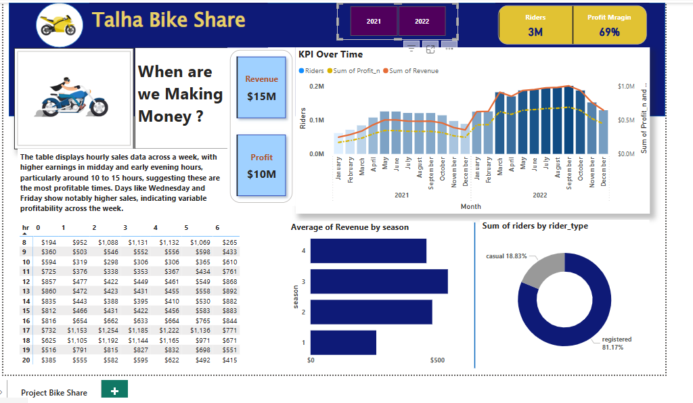

# Bike Share Analysis – SQL & Power BI

## Dashboard Preview


This dashboard provides key insights into bike share performance, including:
- **Revenue & Profit Analysis**  
- **Seasonal Trends** and profitability by time and day  
- **Rider Type Analysis** (casual vs. registered)  
- **KPI Tracking** for total riders, revenue, and profit margin  

---

## Project Overview
This project uses **SQL** and **Power BI** to analyze bike share data across multiple years.  
The goal is to determine **when the business makes the most money**, identify key patterns in demand, and track **profitability**.

Data is combined from multiple yearly tables using SQL and visualized in an interactive Power BI dashboard.

---

## Files
- `Bike Project.pbix` → Power BI dashboard file.  
- `Bike_share.png` → Dashboard image preview.  
- `README.md` → This documentation.

---

## Dataset Structure
### Tables:
1. **bike_share_yr_0** – Data for year 2021  
2. **bike_share_yr_1** – Data for year 2022  
3. **cost_table** – Cost of goods sold (COGS) and price by year  

### Key Columns:
- `dteday` – Date of transaction  
- `season` – Season indicator (1 to 4)  
- `yr` – Year (0 or 1)  
- `weekday` – Day of the week  
- `hr` – Hour of the day  
- `rider_type` – Type of rider (`casual` or `registered`)  
- `riders` – Number of riders  
- `price` – Price per ride  
- `COGS` – Cost of goods sold  

---

## SQL Logic
The SQL combines both yearly datasets and calculates **Revenue** and **Profit**.

```sql
WITH cte AS (
    SELECT * FROM bike_share_yr_0
    UNION ALL
    SELECT * FROM bike_share_yr_1
)
SELECT
    dteday,
    season,
    a.yr,
    weekday,
    hr,
    rider_type,
    riders,
    price,
    COGS,
    ROUND(riders * price, 2) AS revenue,
    ROUND(riders * price - COGS, 2) AS profit
FROM cte a
LEFT JOIN cost_table b
    ON a.yr = b.yr;
```

---

## How to Use This Project

### Step 1: Database Setup
1. Create a database (e.g., `BikeShareDB`).
2. Import your three datasets:
   - `bike_share_yr_0`
   - `bike_share_yr_1`
   - `cost_table`
3. Run the provided SQL query to combine and calculate **Revenue** and **Profit**.

---

### Step 2: Power BI Setup
1. Open **Power BI Desktop**.
2. Go to **Get Data → SQL Server** and connect to your database.
3. Load the combined dataset or use the SQL query directly in Power BI.
4. Open `Bike Project.pbix` and update the data source connection.
5. Refresh the report to see your visualizations with the latest data.

---

## Dashboard Features
The dashboard includes:

1. **KPIs**
   - Total Riders
   - Profit Margin
   - Total Revenue
   - Total Profit

2. **Visuals**
   - **KPI Over Time:** Riders vs. Revenue vs. Profit
   - **Revenue by Hour:** Shows which hours generate the most money
   - **Average Revenue by Season:** Seasonal performance insights
   - **Rider Type Breakdown:** Registered vs. Casual users
   - **Hourly & Daily Patterns:** To identify high-demand periods

---

## Insights
From the analysis:
- **Peak hours**: Midday and early evening (10 AM to 3 PM).  
- **Busiest days**: Wednesday and Friday show highest activity.  
- **Seasonal trends**: Summer months bring the most revenue.  
- **Profit margin**: 69% overall, driven by high volume in peak months.  

---

## Folder Structure
```
bike-share-project/
│
├── Bike Project.pbix             # Power BI dashboard
├── Bike_share.png                 # Dashboard preview image
├── README.md                      # Documentation
└── sql/
    └── bike_share_analysis.sql    # SQL query file
```

---

## Author
- **Name:** Mahbubur Rahman  
- **Email:** m.rahman1091@gmail.com  
- **GitHub:** [https://github.com/mrahman1091-eng](https://github.com/mrahman1091-eng)
